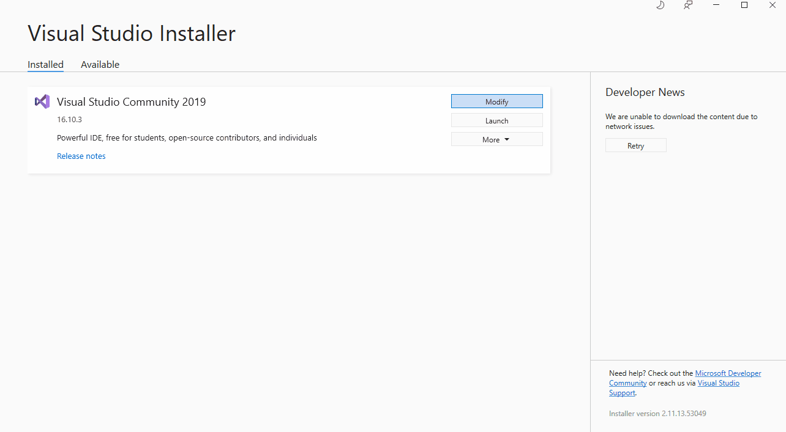
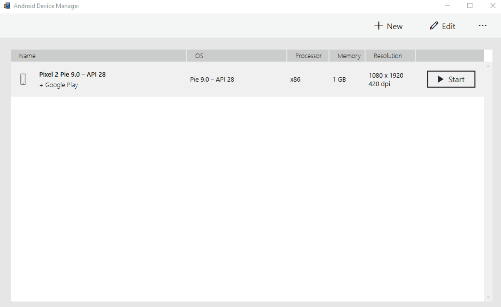

# Android Stock Taking App | Xamarin Forms

## Table of contents
* [Showcase](#showcase)
  * [Home Screen](#home-screen)
  * [Add Company](#add-company)
  * [Login Screen](#login-screen)
  * [Inventory Overview](#inventory-overview)
  * [Add Product](#add-product)
  * [Add Transaction](#add-transaction)
  * [Alerts](#alerts)
  * [Settings](#settings)
* [Getting Started](#getting-started)
* [Run Application](#run-application)
* [Download APK](#download-apk)
* [IMPORTANT!](#important-!)


## Showcase

### Home Screen

### Add Company

### Login Screen

### Inventory Overview

### Add Product

###  Add Transaction

###  Alerts

### Settings


## Getting Started

```bash
Install Visual Studio 2019 or Later

Install Xamarin Forms
```


```bash
git clone https://github.com/Codzaa/StockTakingAndroidApp.git

cd StockTakingAndroidApp

```
```bash
Install Android sdk
```

```bash
Install Emulator or Plug in Android Phone
```


### Run Application
```bash
Build Application

Start Application
```
### Download APK

1. You can download Apk which is located in the Apk Folder.
